# Challenge de Forensic Ping Pong Plouf

## Description
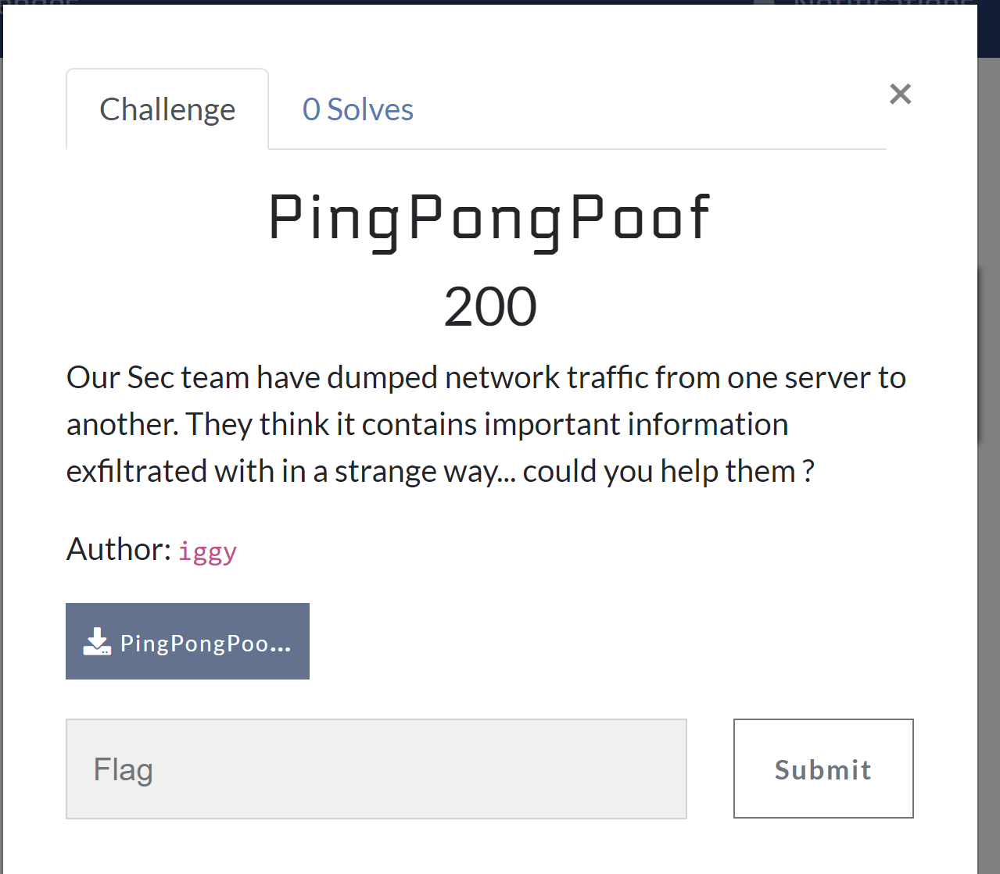

Donc en lisant la description on peut savoir qu'il s'agit d'une exfiltration. Donc à voir ce que nous avons dans le fichier.

## Analyse
En ouvrant le pcap, bon reflexe : Hierarchie des protocoles
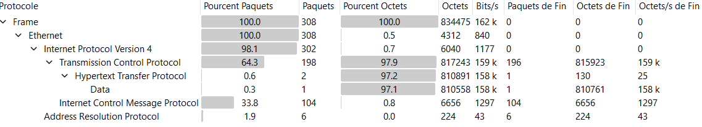

En voyant ça, on peut voir qu'il y'a un peu de HTTP et le reste d'ICMP. Donc il est fort probable que ce soit une exfiltration ICMP.

### Extraction HTTP
La c'est assez simpe, il suffit d'aller dans fichier -> Exporter les objets -> HTTP -> et on voit un fichier et on l'exporte
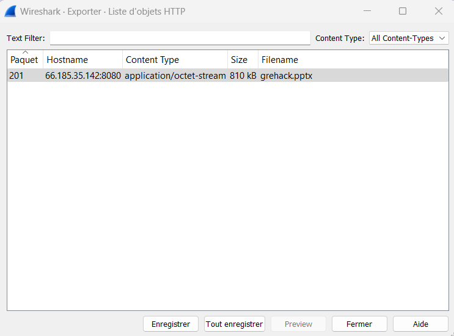

On voit donc que c'est un powerpoint, en l'ouvrant on a les steps qu'on est sensé avoir.
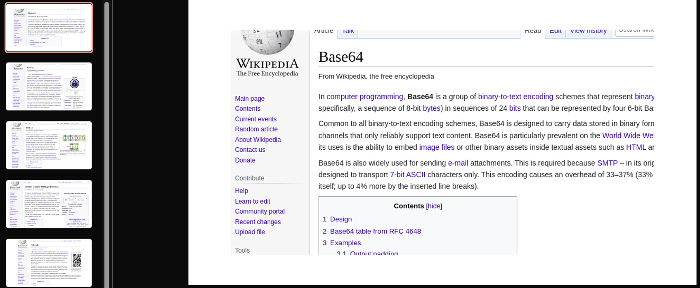

Pour lister dans l'ordre on a :
- Base64
- Keepass
- ROT13
- ICMP
- QR Code

Pour l'instant c'est un peu compliqué d'avoir un base64. Cherchons un Keepass !
### Extraction ICMP
Ce qu'on sait c'est que ICMP est normalement pas fait pour de l'exfiltration car le conteneur est normé.
Ici il y'a par exemple un requete ping depuis un hote linux. Qu'on peut reconnaître depuis le TTL mais aussi par le payload.
#### Exemple
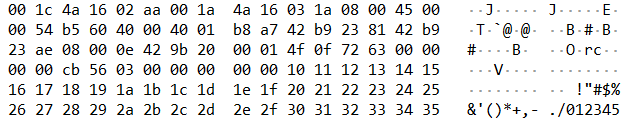

#### Solution
Donc il suffit de trouver une trame qui est un peu differente. Et sur le paquet 233 on voit ce payload 
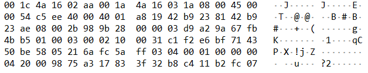

dont les octets du champs data ressemble bizarrement aux Magic Byte d'un fichier keepass. Il est temps d'exfiltrer
##### Exfiltration
J'utilise tshark pour extraire les données de mon pcap.
```Shell
tshark -r PingPongPoof.pcap -T fields -e data -Y "ip.dst == 66.185.35.174 && icmp" | grep -v 303132333435 | xxd -r -p > filetest.dat
```
pour détailler :
- -r pour definir mon fichier 
- -T fields pour dire que je veux extraire une objet en particulier
- -e l'objet que je veux extraire
- -Y " ip.dst == 66.185.35.174 && icmp" : qui est le filtre que j'utilise pour synthetiser les données 

Ensuite je fait un 
- grep -v : qui me retourne tout les resultats qui ne matche pas avec ma chaine de caractere
  - Suivi du 123456 en hexa pour enlever toutes les trames standard 
- xxd -r -p : Pour convertir ma stdin de string à ma stdout en byte 
- > filetest.dat : pour stocker dans un fichier 

Ensuite on peut faire un file sur le fichier pour voir ce que c'est :

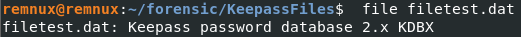

La on peut barrer le partie keepass du pptx ainsi que la partie ICMP ce qui nous donne donc :
- Base64
- -Keepass-
- ROT13
- -ICMP-
- QR Code

On va donc se pencher un peu plus sur le reste
### Retour sur le pptx :)
Ce qui est le plus probable de nous donner un password pour notre keepass est <b>le QR Code</b>.

Donc ici on peut voir que le QR Code est tronqué, il s'agit de la slide5, et que ce n'est pas le meme que sur wikipedia

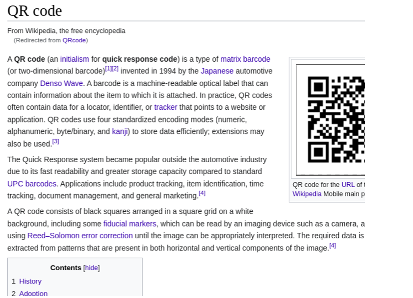

La il s'agirait de trouver ... le QR Code complet. Apres avoir passé plusieurs heures. Et avoir testé bcp de choses. En regardant un peu partout, on peut voir que les fichier pptx contienne l'entete PK pour PKZIP donc on peut tenter de le unzip. En le dezippant. On a la structure complete (avec les XML) des fichiers powerpoint et les images completes.

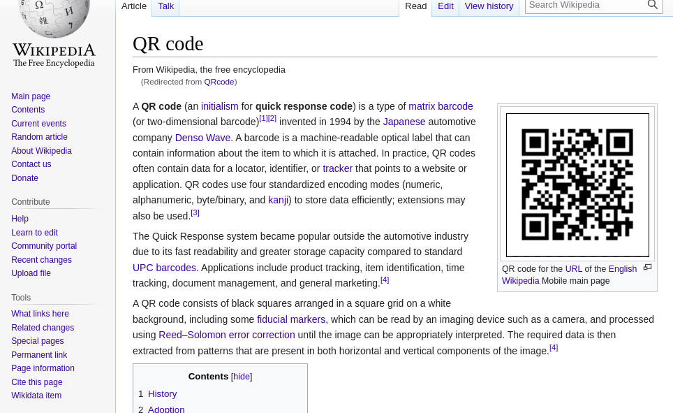

et ca nous permet d'enlever encore un item de notre checklist : 
- Base64
- -Keepass-
- ROT13
- -ICMP-
- -QR Code-


### Scan du QR Code
Quand on scanne le qrcode on obtient la chaine suivante :
```
ovVcrmx5GK5LDGc7BRc0IJZ/D2y3ExuMWQ8zLN==
```

En mettant cette chaine sur Cyberchef, il detecte automatiquement de la base64, sachant qu'il existe un base64 rot13 sur cyberchef. Laisson le gerer pour nous 

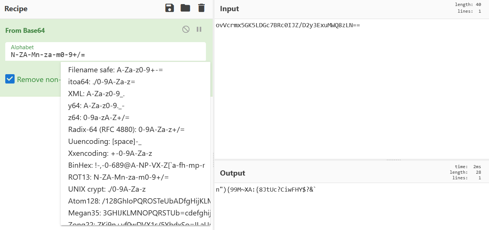

On peut supposer que ce resultat est donc le password de notre keypass.

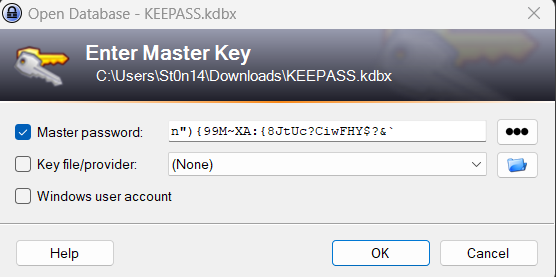

et voila le flag (En ayant flag à la fin du CTF bien sur)

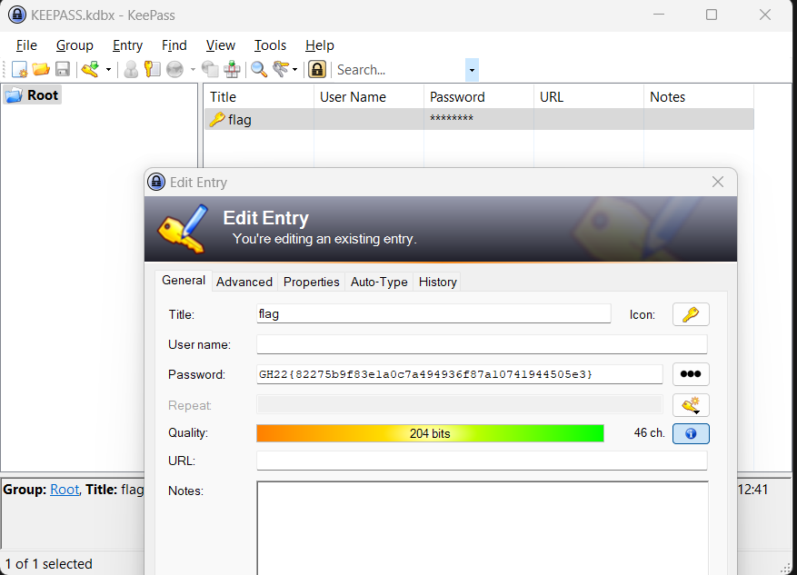

